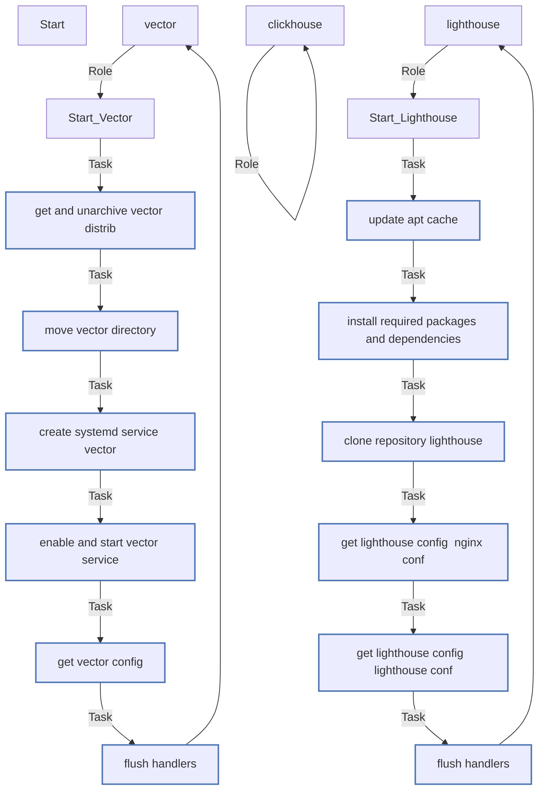

# Задание 8-ansible-04-role

## Роли

| Field                | Value           |
|--------------------- |-----------------|
| Readme update        | 09/02/2025 |

## Сценарии

```yml
---
- name: Install Clickhouse
  hosts: clickhouse
  roles:
    - clickhouse
- name: Install Vector
  hosts: vector
  roles:
    - vector
- name: Install Lighthouse
  hosts: lighthouse
  roles:
    - lighthouse

```



