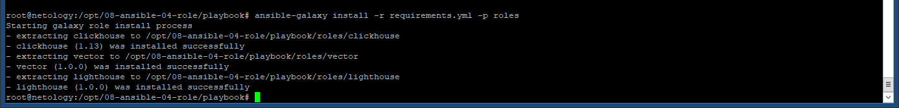
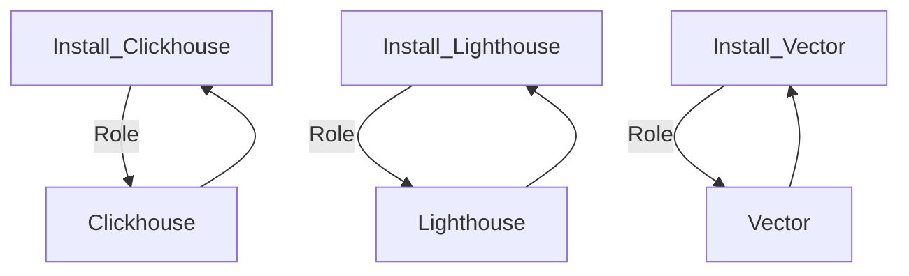
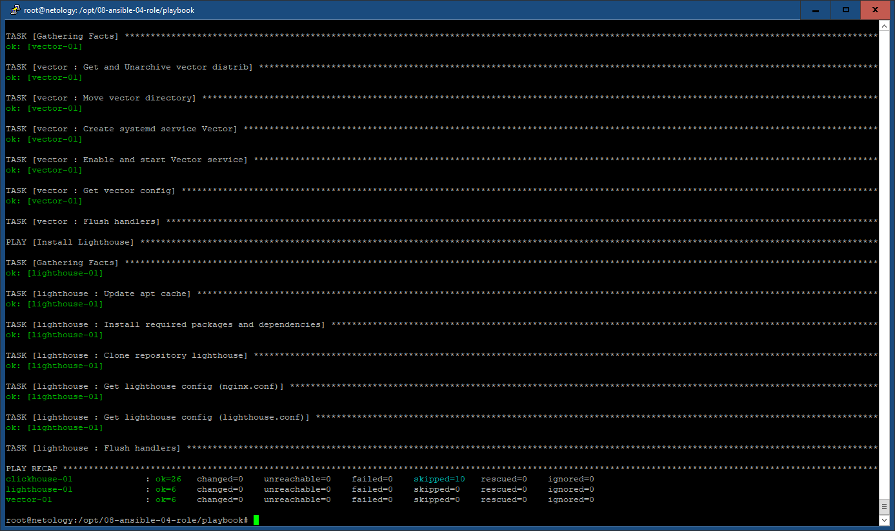

# Задание 8-ansible-04-role
Это задание основано на [08-ansible-03-yandex](https://github.com/tvm2360/08-ansible-03-yandex) с применением ролей.

## Роли
| Роли                | Ссылка                                                       |
|---------------------|--------------------------------------------------------------|
| Clickhouse          | https://github.com/AlexeySetevoi/ansible-clickhouse.git      |
| Lighthouse          | https://github.com/tvm2360/08-ansible-04-role-lighthouse     |
| Vector              | https://github.com/tvm2360/08-ansible-04-role-vector         |

| Field                | Value           |
|--------------------- |-----------------|
| Readme update        | 09/02/2025 |

``` ansible
- src: git@github.com:AlexeySetevoi/ansible-clickhouse.git
  scm: git
  version: "1.13"
  name: clickhouse
- src: git@github.com:tvm2360/08-ansible-04-role-vector.git
  scm: git
  version: "1.0.0"
  name: vector
- src: git@github.com:tvm2360/08-ansible-04-role-lighthouse.git
  scm: git
  version: "1.0.0"
  name: lighthouse
```

``` bash
ansible-galaxy install -r requirements.yml -p roles
```



## Сценарии
```yml
---
- name: Install Clickhouse
  hosts: clickhouse
  roles:
    - clickhouse
- name: Install Vector
  hosts: vector
  roles:
    - vector
- name: Install Lighthouse
  hosts: lighthouse
  roles:
    - lighthouse
```



## Проверка
В задании участвуют 3 виртуальные машины (clickhouse, vector, lighthouse) с установленной ОС Ubuntu 20.04


Заполняем в ./playbook/inventory/prod.yml соответствующие значения ansible_host IP виртуальных машин, проверяем
корректность заполнения порта ssh (по умолчанию 22), а также имя пользователя c правами root и ссылку закрытый ключ:

``` ansible
clickhouse:
  hosts:
    clickhouse-01:
      ansible_host: 51.250.112.140
      ansible_port: 22
      ansible_user: vitas
      ansible_ssh_private_key_file: "~/.ssh/id_yc_ed25519"
vector:
  hosts:
    vector-01:
      ansible_host: 130.193.35.244
      ansible_port: 22
      ansible_user: vitas
      ansible_ssh_private_key_file: "~/.ssh/id_yc_ed25519"
lighthouse:
  hosts:
    lighthouse-01:
      ansible_host: 158.160.158.189
      ansible_port: 22
      ansible_user: vitas
      ansible_ssh_private_key_file: "~/.ssh/id_yc_ed25519"
```

``` bash
ansible-playbook -i inventory/prod.yml site.yml --diff
```

